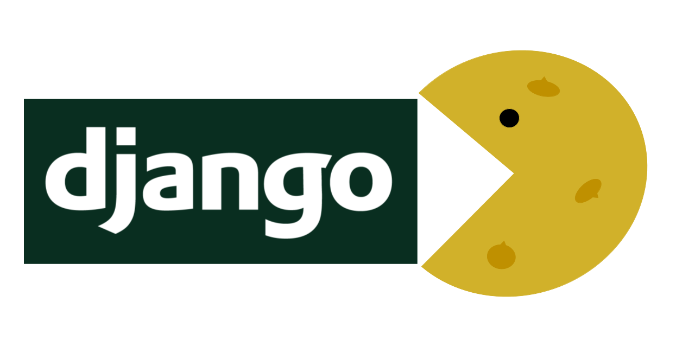

=======================
**Django Cookiecutter**
=======================

A `Django`_  project `cookiecutter`_ complete with built-in continuous
delivery using GitHub actions.

.. _Django: https://www.djangoproject.com/
.. _cookiecutter: https://github.com/cookiecutter/cookiecutter

.. image:: https://www.repostatus.org/badges/latest/concept.svg
   :alt: Project Status: Concept – Minimal or no implementation has been done yet, or the repository is only intended to be a limited example, demo, or proof-of-concept.
   :target: https://www.repostatus.org/#concept

.. image:: https://app.codacy.com/project/badge/Grade/87fb6c8ef02d4433b87e483a9a926d62
   :alt: Codacy Quality
   :target: https://www.codacy.com/gh/imAsparky/django-cookiecutter/dashboard?utm_source=github.com&utm_medium=referral&utm_content=imAsparky/django-cookiecutter&utm_campaign=Badge_Grade

.. image:: https://img.shields.io/badge/pre--commit-enabled-brightgreen?logo=pre-commit&logoColor=white
   :target: https://github.com/pre-commit/pre-commit
   :alt: pre-commit

.. image:: https://readthedocs.org/projects/django-cookiecutter/badge/?version=latest
   :target: https://django-cookiecutter.readthedocs.io/en/latest/?badge=latest
   :alt: Documentation Status

Contributing
------------

Contributions are very welcome and appreciated!

You can contribute in many ways.

See our `Contributing How-To
<https://django-cookiecutter.readthedocs.io/en/latest/how-tos/
how-to-contribute.html#contribute-how-to>`_ to help you get started.

Please take a moment to read our `Code of Conduct
<https://django-cookiecutter.readthedocs.io/en/latest/
code-of-conduct.html#code-of-conduct>`_ for how we would like our community
to treat each other.
