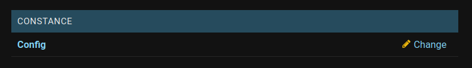
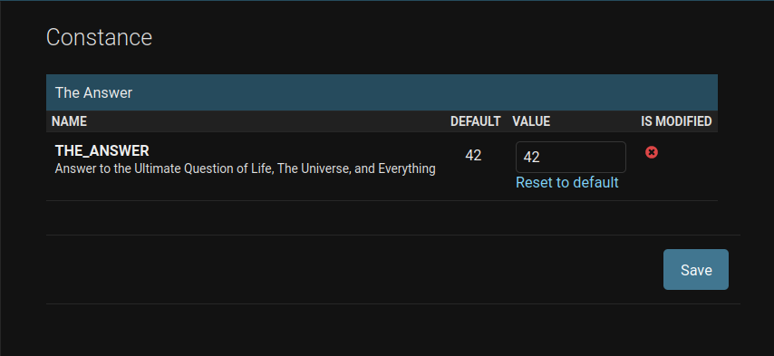

.. include:: /extras.rst.txt
.. highlight:: rst
.. index:: how-to-constance ; Index

.. _how-to-constance:

=========
Constance
=========

django-constance provides the convenience of dynamic site settings,
accessible in the Admin panel.

There are many configuration options available; for more, see further
reading below.

django-cookiecutter employs the django-constance database configuration option.

Adding dynamic settings is done in `config/settings/base.py`.

.. code-block:: python
    :linenos:

    CONSTANCE_CONFIG = {
    'THE_ANSWER': (42, 'Answer to the Ultimate Question of Life, '
                       'The Universe, and Everything', int),
    }

In the example above, provided in `config/settings/base.py`,

`THE_ANSWER`: is the dynamic settings key.

`42`: is the default value if `THE_ANSWER` is not found in the backend.

`Help` text displayed in the Admin panel.
		'Answer to the Ultimate Question of Life, '
		'The Universe, and Everything'

`int`: optional indicates the value type.

The supported types are:

    - bool
    - int
    - float
    - Decimal
    - str
    - datetime
    - date
    - time

Changing Settings
_________________

Settings you have provided in `base.py`, shown above, can be changed in the
Admin panel.

**Select** `Config` in the Constance section.

|

**Change** the setting.

The example dynamic setting provided with django-cookiecutter is below.

|

Further Reading
---------------

For additional Constance and custom configurations.

`Constance config quickstart`_.

Constance provides several backend options to store configuration values.
By default, it uses the `Redis` backend. django-cookiecutter uses `database`.

`Constance backends`_.

Use `override_config` class for testing how your app behaves with different config values.

`Constance config for testing`_.

.. _Constance config quickstart: https://django-constance.readthedocs.io/en/latest/index.html
.. _Constance backends:
.. _Constance config for testing: https://django-constance.readthedocs.io/en/latest/testing.html
