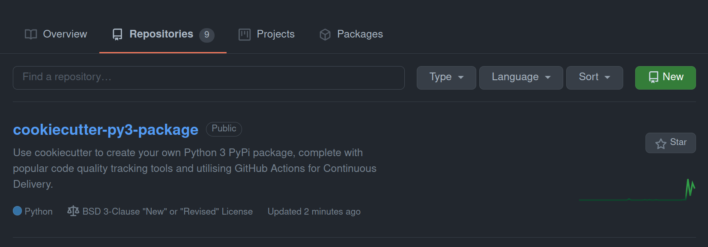
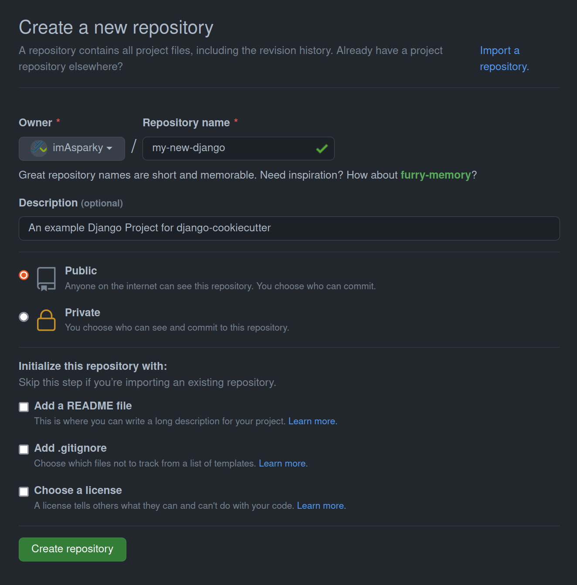
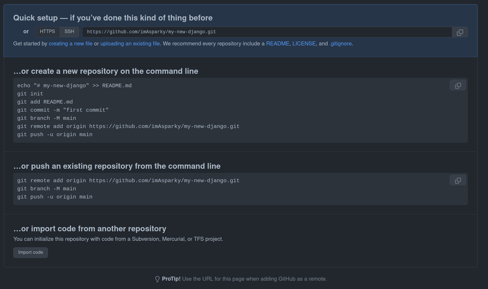

.. include:: /extras.rst.txt
.. highlight:: rst
.. index:: create-GH-repo ; Index

.. _create-GH-repo:
==========================
Create a GitHub Repository
==========================

|

See a list of steps below to get your GitHub Repository up
and running fast.

Pre-requisites
==============

A `GitHub <https://github.com/join>`_ account.

.. _create-GH-repo-tutorial:
Tutorial
========

Navigate to your GitHub account Repositories page and click New.

+++++++++++++++++++++++++++++++++++++++++++++++++++++++++++++++++++++++++++++++

Fill in your new repository name. If you get a green tick, your chosen name
is available.

Fill in a short description.

Click `Create Repository`.

.. hint::

    No need to choose any `Initialize this repository with:` options.

    These are all generated for you when you create your Django project.

.. important::

    The repository name and short description are prompts that you will
    fill in when creating your django-cookiecutter.

    .. code-block:: bash

        "git_project_name":
        "project_short_description":

+++++++++++++++++++++++++++++++++++++++++++++++++++++++++++++++++++++++++++++++

.. _new-repo-cli-options:
New Repository Command Line Options
-----------------------------------

After clicking `Create Repository` you will be presented with these options.

Here you can choose how you want to get started and the commands are
conveniently described.

.. hint::

    If you prefer, django-cookiecutter can set the local repository up for
    you and get it ready for the first push, complete with a
    `Conventional Commits <https://www.conventionalcommits.org/en/v1.0.0/>`_
    style message.

    The option used by django-cookiecutter to do this is a slightly
    modified `…or create a new repository on the command line`.

    To enable automatic local git setup, choose the default setting on the
    following option.

    .. code-block:: bash

        "automatic_set_up_git_and_initial_commit": "y",

Whats next?
-----------

:ref:`Create a Django Cookiecutter Project<cookie-create-pkg>`.

or you can

Check out our other :ref:`Tutorials<tutorial-index>` for more information on
how to get the most out of your cookiecutter package.
