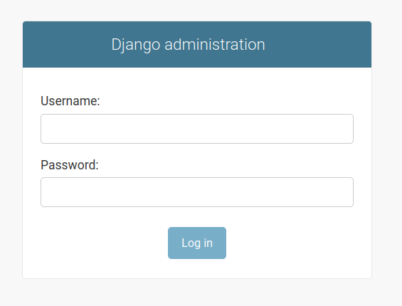

.. highlight:: rst
.. index:: cookie-create-pkg ; Index

.. _cookie-create-pkg:
============================
Create a Django Cookiecutterrk

============================

|

See a list of the steps below to get up get your Django Cookiecutter Project up
and running fast.

.. note::

    This method allows you to create many django-cookiecutter projects without
    the need to re-create the virtual environments.

    For example, a new user may want to generate several projects trying
    different options.

    More advanced users may choose a different way to structure their virtual
    environments.
|

Pre-requisites
==============

`Python 3.8 <https://www.python.org/downloads/>`_ or greater installed on
your computer.

:ref:`Create a GitHub repository.<create-GH-repo>`

.. _create-cookiecutter-tutorial:
Tutorial
========

Navigate to the folder you wish to create your django-cookiecutter.

Here we are using `projects`.

.. code-block:: bash

  dev@aps-dev:~/projects$

.. _create-virtual-environemnt:
Create a Virtual Environment
----------------------------

Select the tab for your preferred Operating System.

.. note::

    The commands to create a virtual environment below will use the default
    Python version in your Operating System.

    If you prefer another python version installed on your computer, you can
    replace `python3.8` with `python3.n`, where n is the version number.

.. tab:: Linux

    .. code-block:: bash
        :caption: **bash/zsh**

        python3.8 -m venv my_venv

    You will have a folder structure similar to this.

    .. code-block:: bash

            projects
            └── my_venv

.. tab:: macOS

    .. code-block:: bash
        :caption: **bash/zsh**

        python3.8 -m venv my_venv

    You will have a folder structure similar to this.

    .. code-block:: bash

            projects
            └── my_venv

.. tab:: Windows

    If you have installed Python in your PATH and PATHEXT.

    .. code-block:: bash
        :caption: **cmd/PowerShell**

        python3.8 -m venv my_venv

    Otherwise use

    .. code-block:: bash
        :caption: **cmd/PowerShell**

        c:\>c:\Python38\python -m venv c:\path\to\projects\my_env

    You will have a folder structure similar to this.

    .. code-block:: cmd

            projects
            └── my_venv

.. _activate-virtual-environemnt:
Activate Virtual Environment
----------------------------

Ensure you are in the same folder as `my_env`. In this example, we are in the
`projects` folder.  Use the following command for your Operating System to
activate the virtual environment.

.. tab:: Linux

    .. code-block:: bash
        :caption: **bash/zsh**

        source my_env/bin/activate

.. tab:: macOS

    .. code-block:: bash
        :caption: **bash/zsh**

        source my_env/bin/activate

.. tab:: Windows

    .. code-block:: bash
            :caption: **cmd**

            my_env\Scripts\activate.bat

    .. code-block:: bash
            :caption: **PowerShell**

            my_env\Scripts\Activate.ps1

After activating the virtual environment, your cli will look something like
this, identifying the name of the virtual environment at the start.

.. code-block:: bash

    (my_env) dev@aps-dev:~/projects$

.. _install-cookiecutter:
Install Cookiecutter
--------------------

Firstly it's advisable to upgrade pip using the following command.

.. code-block:: bash
    :caption: **Linux, macOS and Windows**

    pip install --upgrade pip

You will see something similar to this in your CLI.

.. code-block:: cmd

    Requirement already satisfied: pip in ./my_env/lib/python3.9/site-packages (21.2.3)
    Collecting pip
     Using cached pip-21.2.4-py3-none-any.whl (1.6 MB)
    Installing collected packages: pip
      Attempting uninstall: pip
        Found existing installation: pip 21.2.3
        Uninstalling pip-21.2.3:
          Successfully uninstalled pip-21.2.3
    Successfully installed pip-21.2.4

Install cookiecutter_ into your virtual environment.

.. code-block:: bash
    :caption: **Linux, macOS and Windows**

    pip install cookiecutter

You will see something similar to this in your CLI.

.. code-block:: cmd

    Collecting cookiecutter
      Using cached cookiecutter-1.7.3-py2.py3-none-any.whl (34 kB)
    Collecting jinja2-time>=0.2.0
      Using cached jinja2_time-0.2.0-py2.py3-none-any.whl (6.4 kB)
    Collecting python-slugify>=4.0.0
      Using cached python_slugify-5.0.2-py2.py3-none-any.whl (6.7 kB)
    Collecting binaryornot>=0.4.4
      Using cached binaryornot-0.4.4-py2.py3-none-any.whl (9.0 kB)
    Collecting requests>=2.23.0
      Using cached requests-2.26.0-py2.py3-none-any.whl (62 kB)
    Collecting poyo>=0.5.0
      Using cached poyo-0.5.0-py2.py3-none-any.whl (10 kB)
    Collecting six>=1.10
      Using cached six-1.16.0-py2.py3-none-any.whl (11 kB)
    Collecting click>=7.0
      Using cached click-8.0.1-py3-none-any.whl (97 kB)
    Collecting Jinja2<4.0.0,>=2.7
      Using cached Jinja2-3.0.1-py3-none-any.whl (133 kB)
    Collecting chardet>=3.0.2
      Using cached chardet-4.0.0-py2.py3-none-any.whl (178 kB)
    Collecting MarkupSafe>=2.0
      Using cached MarkupSafe-2.0.1-cp39-cp39-manylinux_2_5_x86_64.manylinux1_
      x86_64.manylinux_2_12_x86_64.manylinux2010_x86_64.whl (30 kB)
    Collecting arrow
      Using cached arrow-1.1.1-py3-none-any.whl (60 kB)
    Collecting text-unidecode>=1.3
      Using cached text_unidecode-1.3-py2.py3-none-any.whl (78 kB)
    Collecting idna<4,>=2.5
      Using cached idna-3.2-py3-none-any.whl (59 kB)
    Collecting charset-normalizer~=2.0.0
      Using cached charset_normalizer-2.0.6-py3-none-any.whl (37 kB)
    Collecting certifi>=2017.4.17
      Using cached certifi-2021.5.30-py2.py3-none-any.whl (145 kB)
    Collecting urllib3<1.27,>=1.21.1
      Using cached urllib3-1.26.7-py2.py3-none-any.whl (138 kB)
    Collecting python-dateutil>=2.7.0
      Using cached python_dateutil-2.8.2-py2.py3-none-any.whl (247 kB)
    Installing collected packages: six, python-dateutil, MarkupSafe, urllib3,
     text-unidecode, Jinja2, idna, charset-normalizer, chardet, certifi, arrow,
     requests, python-slugify, poyo, jinja2-time, click, binaryornot, cookiecutter
    Successfully installed Jinja2-3.0.1 MarkupSafe-2.0.1 arrow-1.1.1
     binaryornot-0.4.4 certifi-2021.5.30 chardet-4.0.0 charset-normalizer-2.0.6
     click-8.0.1 cookiecutter-1.7.3 idna-3.2 jinja2-time-0.2.0 poyo-0.5.0
     python-dateutil-2.8.2 python-slugify-5.0.2 requests-2.26.0 six-1.16.0
     text-unidecode-1.3 urllib3-1.26.7

Check new packages installed into your virtual environment.

.. code-block:: bash
    :caption: **Linux, macOS and Windows**

    pip freeze

You will see something similar to this in your CLI.

.. code-block:: cmd

    arrow==1.1.1
    binaryornot==0.4.4
    certifi==2021.5.30
    chardet==4.0.0
    charset-normalizer==2.0.6
    click==8.0.1
    cookiecutter==1.7.3
    idna==3.2
    Jinja2==3.0.1
    jinja2-time==0.2.0
    MarkupSafe==2.0.1
    poyo==0.5.0
    python-dateutil==2.8.2
    python-slugify==5.0.2
    requests==2.26.0
    six==1.16.0
    text-unidecode==1.3
    urllib3==1.26.7

.. _create_django-project:
Create Your Django Project
--------------------------

In your projects folder, use the following command.

.. code-block:: bash
    :caption: **Linux, macOS and Windows**

    cookiecutter https://github.com/imAsparky/django-cookiecutter

Cookiecutter will ask questions to set your package up.
If you're unsure or don't know what to enter, stick with the defaults.

See :ref:`Reference-Inputs<project-inputs>` for more details about the
django-cookiecutter project options.

.. _an-example-django:
An Example Django Project
-------------------------

.. code-block:: cmd
    :caption: **An example package created with some non default selections**

      (my_env) dev@aps-dev:~/projects$ cookiecutter https://github.com/imAsparky/django-cookiecutter
      author_name [Mark Sevelj]:
      email [mark@example.com]:
      github_username [imAsparky]:
      github_user_email [mark@example.com]:
      project_name [Django Boilerplate]: My New Django
      git_project_name [my-new-django]:
      project_slug [my_new_django]:
      project_short_description [A Django project with all the boilerplate]: An example Django Project for django-cookiecutter
      version [0.1.0]:
      ALLOWED_HOSTS []: www.example.com (NON-DEFAULT)
      INTERNAL_IPS []:
      LANGUAGE_CODE [en]:
      LANGUAGES [en, hi]:
      TIME_ZONE [UTC]:
      Select USE_I18N:
      1 - True
      2 - False
      Choose from 1, 2 [1]:
      SITE_ID [1]:
      Select deploy_with_docker:
      1 - n
      2 - y
      3 - swarm
      Choose from 1, 2, 3 [1]:
      Select use_pre_commit:
      1 - y
      2 - n
      Choose from 1, 2 [1]:
      Select create_conventional_commits_edit_message:
      1 - y
      2 - n
      Choose from 1, 2 [1]:
      Select use_GH_custom_issue_templates:
      1 - y
      2 - n
      Choose from 1, 2 [1]:
      Select automatic_set_up_git_and_initial_commit:
      1 - y
      2 - n
      Choose from 1, 2 [1]:
      Select create_repo_auto_test_workflow:
      1 - y
      2 - n
      Choose from 1, 2 [1]:
      Select use_GH_action_semantic_version:
      1 - y
      2 - n
      Choose from 1, 2 [1]:
      Select include_sphinx_docs:
      1 - y
      2 - n
      Choose from 1, 2 [1]:
      Select use_readthedocs:
      1 - y
      2 - n
      Choose from 1, 2 [1]:
      Select include_documentation_templates:
      1 - y
      2 - n
      Choose from 1, 2 [1]:
      Select include_how_to_contribute_template:
      1 - y
      2 - n
      Choose from 1, 2 [1]:
      Select include_contributor_covenant_code_of_conduct:
      1 - y
      2 - n
      Choose from 1, 2 [1]:
      Select use_repo_status_badge:
      1 - no
      2 - concept
      3 - wip
      4 - active
      Choose from 1, 2, 3, 4 [1]: 2  (NON-DEFAULT)
      Select use_pyup_io:
      1 - y
      2 - n
      Choose from 1, 2 [1]:
      Select open_source_license:
      1 - MIT license
      2 - BSD license
      3 - ISC license
      4 - Apache Software License 2.0
      5 - GNU General Public License v3
      6 - Not open source
      Choose from 1, 2, 3, 4, 5, 6 [1]: 2  (NON DEFAULT)
      (my_env) dev@aps-dev:~/projects$

.. hint::

  See below, notice the project_name format and how django-cookiecutter
  automatically formats the name for your GitHub repository and python module
  as default inputs.

  .. code-block:: cmd

    project_name [Django Boilerplate]: My New Django
    git_project_name [my-new-django]:
    project_slug [my_new_django]:

.. new-folder-structure::
Folder Structure
----------------

If you have been following along the Tutorial order, your directory structure
will look something similar to this.

.. code-block:: cmd

  projects
    ├── my-new-django
    │   ├── .env
    │   │   ├── .local
    │   │   ├── .production
    │   │   ├── .staging
    │   │   └── .testing
    │   ├── .git
    │   ├── CHANGELOG.md
    │   ├── LICENSE.rst
    │   ├── README.rst
    │   ├── config
    │   │   ├── requirements
    │   │   │   ├── base.txt
    │   │   │   ├── local.txt
    │   │   │   ├── production.txt
    │   │   │   ├── staging.txt
    │   │   │   └── test.txt
    │   │   └── settings
    │   │       ├── __init__.py
    │   │       ├── base.py
    │   │       ├── local.py
    │   │       ├── production.py
    │   │       ├── staging.py
    │   │       ├── test.py
    │   │       └── username_blacklist.py
    │   ├── docs
    │   │   ├── Makefile
    │   │   ├── __init__.py
    │   │   ├── build
    │   │   ├── make.bat
    │   │   ├── requirements.txt
    │   │   └── source
    │   ├── manage.py
    │   ├── my_new_django
    │   │   ├── __init__.py
    │   │   ├── asgi.py
    │   │   ├── urls.py
    │   │   └── wsgi.py
    │   ├── users
    │   │   ├── __init__.py
    │   │   ├── admin.py
    │   │   ├── apps.py
    │   │   ├── forms.py
    │   │   ├── migrations
    │   │   │   └── __init__.py
    │   │   ├── models.py
    │   │   └── views.py
    │   ├── pytest.ini
    │   ├── requirements_dev.txt
    │   └── templates
    │       └── account
    │
    └── my_env
        ├── bin
        ├── include
        ├── lib
        ├── lib64 -> lib
        └── pyvenv.cfg

.. _install-django:
Install Django
--------------

Change directory to your new django project, the one containing manage.py.

.. code-block:: bash

    cd my-new-django

Install Django_ into your virtual environment.

.. note::

  Ensure you are in the root folder, the one containing manage.py

.. code-block:: bash
    :caption: **Linux, macOS and Windows**

    pip install -r requirements_dev.txt

Check new packages installed into your virtual environment.

.. code-block:: bash
    :caption: **Linux, macOS and Windows**

    pip freeze

You will see something similar to this in your CLI.

.. code-block:: cmd

    alabaster==0.7.12
    arrow==1.2.1
    asgiref==3.4.1
    attrs==21.2.0
    Babel==2.9.1
    backports.entry-points-selectable==1.1.1
    beautifulsoup4==4.10.0
    binaryornot==0.4.4
    certifi==2021.10.8
    cffi==1.15.0
    cfgv==3.3.1
    chardet==4.0.0
    charset-normalizer==2.0.8
    click==8.0.3
    cookiecutter==1.7.3
    cryptography==36.0.0
    defusedxml==0.7.1
    distlib==0.3.4
    dj-inmemorystorage==2.1.0
    Django==4.0
    django-allauth==0.47.0
    django-debug-toolbar==3.2.4
    django-debug-toolbar-template-profiler==2.0.2
    django-environ==0.8.1
    docutils==0.17.1
    execnet==1.9.0
    filelock==3.4.0
    furo==2021.11.23
    identify==2.4.0
    idna==3.3
    imagesize==1.3.0
    iniconfig==1.1.1
    Jinja2==3.0.3
    jinja2-time==0.2.0
    markdown-it-py==1.1.0
    MarkupSafe==2.0.1
    mdit-py-plugins==0.3.0
    myst-parser==0.16.1
    nodeenv==1.6.0
    oauthlib==3.1.1
    packaging==21.3
    platformdirs==2.4.0
    pluggy==1.0.0
    poyo==0.5.0
    pre-commit==2.16.0
    py==1.11.0
    pycparser==2.21
    Pygments==2.10.0
    PyJWT==2.3.0
    pyparsing==3.0.6
    pytest==6.2.5
    pytest-django==4.5.2
    pytest-forked==1.4.0
    pytest-reverse==1.3.0
    pytest-xdist==2.5.0
    python-dateutil==2.8.2
    python-slugify==5.0.2
    python3-openid==3.2.0
    pytz==2021.3
    PyYAML==6.0
    requests==2.26.0
    requests-oauthlib==1.3.0
    six==1.16.0
    snowballstemmer==2.2.0
    soupsieve==2.3.1
    Sphinx==4.3.2
    sphinx-copybutton==0.4.0
    sphinx_inline_tabs==2021.4.11b9
    sphinxcontrib-applehelp==1.0.2
    sphinxcontrib-devhelp==1.0.2
    sphinxcontrib-htmlhelp==2.0.0
    sphinxcontrib-jsmath==1.0.1
    sphinxcontrib-qthelp==1.0.3
    sphinxcontrib-serializinghtml==1.1.5
    sqlparse==0.4.2
    tblib==1.7.0
    text-unidecode==1.3
    toml==0.10.2
    tox==3.24.4
    urllib3==1.26.7
    virtualenv==20.10.0
    wrapt==1.13.3

.. include:: tutorial-segment-create-env-variable.rst

Before Initial Migration
------------------------

.. important::

    You may wish to make some changes to the Custom User model
    before making your initial migration.

For example, you can change the default user types to suit your application.

See `How-to Custom User`_ for customisation options before your initial migration.

.. _How-to Custom User: <https://django-cookiecutter.readthedocs.io/en/latest/how-tos/how-to-custom-user.html>

Final Project Setup
-------------------

Here we use the default DB SQLite database shipped with Django.

In the root directory, the one with the manage.py file, type the
following commands.

.. code-block:: bash

  python3 manage.py collectstatic --no-input

You will see something similar to this in your CLI.

.. code-block:: bash

  128 static files copied to '/projects/my-new-django/static'

.. code-block:: bash

  python3 manage.py makemigrations

You will see something similar to this in your CLI.

.. code-block:: bash

    Migrations for 'account':
     /home/mdev/projects/dlet/venv/lib/python3.10/site-packages/allauth/account/migrations/0004_alter_emailaddress_id_alter_emailconfirmation_id.py
       - Alter field id on emailaddress
       - Alter field id on emailconfirmation
   Migrations for 'socialaccount':
     /home/mdev/projects/dlet/venv/lib/python3.10/site-packages/allauth/socialaccount/migrations/0005_alter_socialaccount_id_alter_socialapp_id_and_more.py
       - Alter field id on socialaccount
       - Alter field id on socialapp
       - Alter field id on socialtoken

.. code-block:: bash

   python3 manage.py migrate

You will see something similar to this in your CLI.

.. code-block:: bash

    Operations to perform:
      Apply all migrations: account, admin, auth, contenttypes, sessions, sites, socialaccount
    Running migrations:
      Applying contenttypes.0001_initial... OK
      Applying auth.0001_initial... OK
      Applying account.0001_initial... OK
      Applying account.0002_email_max_length... OK
      Applying account.0003_auto_20211008_0148... OK
      Applying admin.0001_initial... OK
      Applying admin.0002_logentry_remove_auto_add... OK
      Applying admin.0003_logentry_add_action_flag_choices... OK
      Applying contenttypes.0002_remove_content_type_name... OK
      Applying auth.0002_alter_permission_name_max_length... OK
      Applying auth.0003_alter_user_email_max_length... OK
      Applying auth.0004_alter_user_username_opts... OK
      Applying auth.0005_alter_user_last_login_null... OK
      Applying auth.0006_require_contenttypes_0002... OK
      Applying auth.0007_alter_validators_add_error_messages... OK
      Applying auth.0008_alter_user_username_max_length... OK
      Applying auth.0009_alter_user_last_name_max_length... OK
      Applying auth.0010_alter_group_name_max_length... OK
      Applying auth.0011_update_proxy_permissions... OK
      Applying auth.0012_alter_user_first_name_max_length... OK
      Applying sessions.0001_initial... OK
      Applying sites.0001_initial... OK
      Applying sites.0002_alter_domain_unique... OK
      Applying socialaccount.0001_initial... OK
      Applying socialaccount.0002_token_max_lengths... OK
      Applying socialaccount.0003_extra_data_default_dict... OK
      Applying socialaccount.0004_auto_20211008_0148... OK

..   code-block:: bash

    python3 manage.py createsuperuser # Follow the prompts

.. code-block:: bash
   :emphasize-lines: 6-8
   :caption: Highlighted lines demonstrate Django Password Validator.

   Username (leave blank to use 'default'): <enter your name>
   Username (leave blank to use 'default'):
   Email address: <enter your email>
   Password:
   Password (again):
   This password is too short. It must contain at least 8 characters.
   This password is too common.
   Bypass password validation and create user anyway? [y/N]: y
   Superuser created successfully.

Run the Tests
-------------

Your project comes complete with a test suite for the custom user.

Tox, the test runner is configured to test locally with Python
3.8, 3.9 and 3.10.

See the following commands for options.

.. code-block:: bash
    :caption: Test against all python versions.

    tox

.. code-block:: bash
    :caption: Test against a single python version.

    tox -e py38

    or

    tox -e py39

    or

    tox -e py3.10

You will see something similar to this in your CLI.

.. code-block:: bash

    platform linux -- Python 3.8.10, pytest-6.2.5, py-1.11.0, pluggy-1.0.0 -- /projects/my-new-django/.tox/py38/bin/python
    cachedir: .tox/py38/.pytest_cache
    django: settings: config.settings.test (from ini)
    rootdir: /projects/my-new-django, configfile: pytest.ini
    plugins: reverse-1.3.0, forked-1.4.0, xdist-2.5.0, django-4.5.2
    [gw0] linux Python 3.8.10 cwd: /projects/my-new-django
    [gw1] linux Python 3.8.10 cwd: /projects/my-new-django
    [gw0] Python 3.8.10 (default, Nov 26 2021, 20:14:08)  -- [GCC 9.3.0]
    [gw1] Python 3.8.10 (default, Nov 26 2021, 20:14:08)  -- [GCC 9.3.0]
    gw0 [6] / gw1 [6]
    scheduling tests via LoadScopeScheduling

    tests/test_custom_user.py::test_create_superuser_errors_raised_ok
    [gw0] [ 16%] PASSED tests/test_custom_user.py::test_create_superuser_errors_raised_ok
    tests/test_custom_user.py::test_create_superuser_ok
    [gw0] [ 33%] PASSED tests/test_custom_user.py::test_create_superuser_ok
    tests/test_custom_user.py::test_create_user_errors_raised_ok
    [gw0] [ 50%] PASSED tests/test_custom_user.py::test_create_user_errors_raised_ok
    tests/test_custom_user.py::test_create_user_is_superuser_ok
    [gw0] [ 66%] PASSED tests/test_custom_user.py::test_create_user_is_superuser_ok
    tests/test_custom_user.py::test_create_user_is_staff_ok
    [gw0] [ 83%] PASSED tests/test_custom_user.py::test_create_user_is_staff_ok
    tests/test_custom_user.py::test_create_user_ok
    [gw0] [100%] PASSED tests/test_custom_user.py::test_create_user_ok

    ================================= PASSES ==================================
    _________________ test_create_superuser_errors_raised_ok___________________
    [gw0] linux -- Python 3.8.10 projects/my-new-django/.tox/py38/bin/python
    -------------------------- Captured stderr setup --------------------------
    Creating test database for alias 'default'...
    ------------------------ Captured stderr teardown -------------------------
    Destroying test database for alias 'default'...
    ============================ 6 passed in 1.19s ============================
    _________________________________ summary _________________________________
      py38: commands succeeded
      congratulations :)

Run Your Project
----------------

Django comes with a development server. This server provides all the features
needed to view your Django project locally; however, it is not suitable for a
production environment.

To view your project in the browser, type the following command.

.. code-block:: bash

    python3 manage.py runserver  # In your browser 127.0.0.1/admin

You will see something similar to this in your CLI.

.. code-block:: bash

  Performing system checks...

  System check identified no issues (0 silenced).
  December 28, 2021 - 03:49:48
  Django version 4.0.0, using settings 'config.settings.local'
  Starting development server at http://127.0.0.1:8000/
  Quit the server with CONTROL-C.

In your browser, navigate to http://127.0.0.1:8000/admin and log in with the
superuser credentials you have created.

Congratulations, you have created your new Django project.

Not working?
~~~~~~~~~~~~

Check config/settings/local.py contains:

.. code-block:: python

  ALLOWED_HOSTS = ["127.0.0.1"]

Whats next?
-----------

:ref:`Create your first git push<create-first-git-push>`.

or you can

Check out our other :ref:`Tutorials<tutorial-index>` for more information on
how to get the most out of your cookiecutter package.

.. _cookiecutter: https://cookiecutter.readthedocs.io/en/1.7.2/installation.html
.. _Django: https://docs.djangoproject.com/en/4.0/
