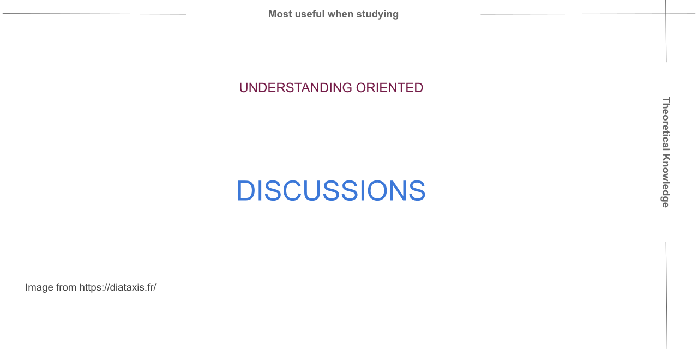

.. include:: ../../extras.rst.txt
.. highlight:: rst
.. index:: Diataxis; Discussions

.. _diataxis-discussions:

===========
Discussions
===========

|

Summary
=======

Discussions clarify and illuminate a particular topic. Discussions are
understanding-oriented.

Discussions deepen and broaden the reader's understanding of a subject.

Discussions aren't concerned with what the user might be doing, like tutorials
and how-to guides.

Discussions approach a topic from a higher perspective and from different angles
that allow a more relaxed, more unrestrained way to consider something.

Discussions join things together, and it makes sense to read while being away
from the product itself.

About
=====

Discussion clarifies a particular topic. Discussions are understanding-oriented
which broadens the reader's understanding of the subject.

Discussion documentation provides a more relaxed way to consider a subject and
joins things together.   Often it makes sense to read while away from the
product in a more comfortable environment.

Description
===========

Discussion documentation doesn't have a natural part in the user's practice
or work, which can appear to reduce its importance.

Discussion documentation may be less urgent than tutorials, how-to-guides and
reference documentation, but it is no less critical.

Discussion documentation is explanatory information that weaves it all together.
Without discussion documentation,  the users grasping and holding onto the
subject concepts can be diminished.

Boundaries
==========

Writing good discussion documentation is difficult due to the open-ended
nature of its scope.

Rarely is specific discussion documentation written; it is more likely to
be scattered in small sections throughout tutorials, how-to-guides and references.

One place to start writing good discussion documentation is with a
question, Why?  From here, it is possible to set some rough scope boundaries
to get started.

FAQ can provide a subject to get started; here are real-world reasons
to write a discussion document.

How-to write Discussions
========================

**Connections**

Discussions help spin the web of understanding for your readers.
Connections, even to things outside the immediate topic, can add clarity
and context.

**Context**

Tell a story—the background and why things have progressed to
this point, historical reasons, design decisions, statutory obligations,
and technical constraints may all be part of the story.

If a good example can be shared, that provides additional context, then
consider including that.

**Whats in a name**

Naming your discussion can be either explicit or implicit.  The discussion
document is a high-level view of the subject; therefore, being precise
is not required.

**Just an opinion**

Consider alternatives and other options in your discussion.  Discussing pro's and cons opens up the topic to be more informative and perhaps guide the reader onto other material in their quest for knowledge.

Discussions may sometimes seem bare; however, providing links to
tutorials, how-to's and reference material where appropriate is better than confusing the
the focus of the discussion.

Further Reading
===============

For further interesting reading on this topic, see `Diátaxis Explanation <https://diataxis.fr/explanation/>`__
