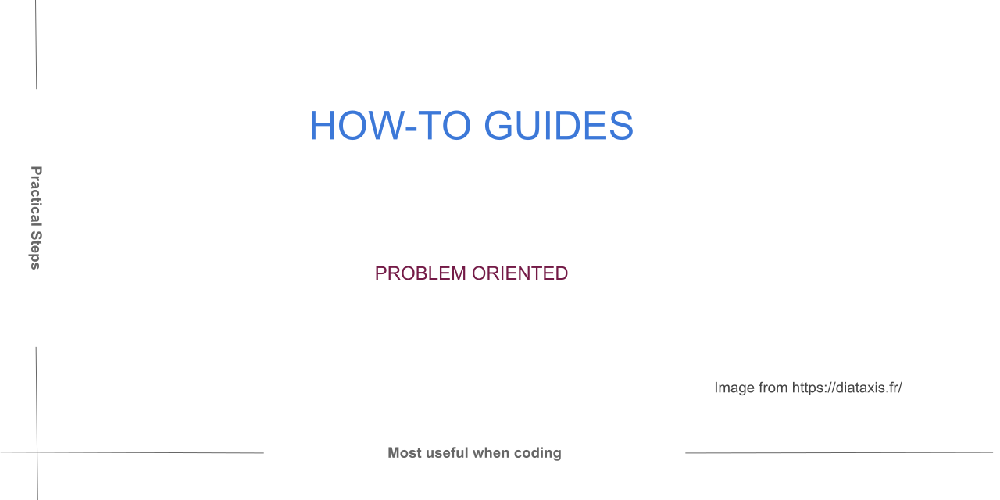

.. include:: ../../extras.rst.txt
.. highlight:: rst
.. index:: Diataxis; How-to

.. _diataxis-how-to:

======
How-to
======

Summary
=======

How-to guides are goal-oriented directions, much like a recipe. They take the
reader through the steps required to solve a real-world problem.

Examples could be calibrating a temperature sensor, using fixtures in pytest,
and configuring a software package.

Building a web application is not addressing a specific goal or problem. It's
a vastly open-ended sphere of skill that is not a how-to.

Tutorials -> How-to Guides
==========================

How-to guides and Tutorials can easily overlap. However, How-to guides serve
a different purpose to tutorials.

See the table below indicating the difference in the user's needs as they
move right along the learning path.

.. table:: **Tutorials -> How-to Guides**
   :widths: auto
   :align: center

   =====================================================   =====================================================
   Tutorials: for a Learner                                How-to: for a User
   =====================================================   =====================================================
   May not know the right question.                        Responsible for the right question.
   Knowlege required is determined by the author.          Knowlege required is determined by the user.
   Learner needs to be lead along the path.                User can choose their own path.
   Learner aquires knowlege.                               User applys knowlege.
   Learner needs to be taught.                             User needs to be shown.
   =====================================================   =====================================================

Often How-to's are better written than tutorials because they share the
same focus as the developer.

The developer has moved past the learning stage, and a How-to is usually
the focus of developers documentation.

Its a Recipe
============

Recipes are an excellent model for writing a how-to guide.

Recipes clearly define the goal by following it, and they address a specific
question: How do I make it?

Following a recipe requires basic competence; a recipe is not a substitute
for a cooking lesson.

Reading about the history of a recipe may be exciting, but it doesn't help
achieve the goal of the recipe.

The history of a recipe will provide the user with better value as they move
right in the learning path towards the "discussion" phase.

Recipes follow a well-established format; similarly, How-to guides should also
follow a format suitable for the technology.

For consistent formatting, The How-to guide could be in the form of a
customisable template.

How-to write a How-to
=====================

How-to guides contain a sequence of actions much like a tutorial.

They differ in a sense; a tutorial mentions that "We are using HTTPS" because
it is very secure, whereas a How-to guide digs deeper into HTTPS, that is, it
shows you how to do a specific action or configuration with HTTPS.

How-to guides don't need the repeatability of a tutorial, but they
should be reliable.

**Solving a Problem**

The goal of a how-to is to solve a problem or complete an unfamiliar task.

Maintaining that focus throughout the how-to removes the mistake of bringing in
"discussion" topics, which unnecessarily increase cognitive load.

**No explanation needed**

Explanations aren't necessary when following a how-to guide.  Adding descriptions
is adding noise on the way to the goal.

**Nice and flexible**

How-to guides should be flexible and adaptable to many use cases, unlike a particular
tutorial to a narrow topic.

**Nothing unnecessary**

Completeness is not a requirement of a how-to, whereas being practical and useable is.

How-to guides should start and end in a meaningful place and require the reader to apply
it to their work.

**What is in a name**

Explicit is better than ambiguous when naming a how-to guide.

An explicit How-to name:

    :emph:`How to integrate application performance monitoring using XYZ.`

    It is clear what this how-to describes.

An ambiguous How-to name:

    :emph:`Integrating application performance monitoring.`

    Perhaps this document is about the question of deciding whether you should
    Integrate application performance or not, or something entirely different.

A terrible How-to name:

    :emph:`Application performance monitoring.`

    This name is very general and does not suggest a how-to guide.
    Perhaps it's a book title.

|

.. note::

    Search engines make use of good document names.

Further Reading
===============

For further interesting reading on this topic, see `Diátaxis How-to <https://diataxis.fr/how-to-guides/>`__
