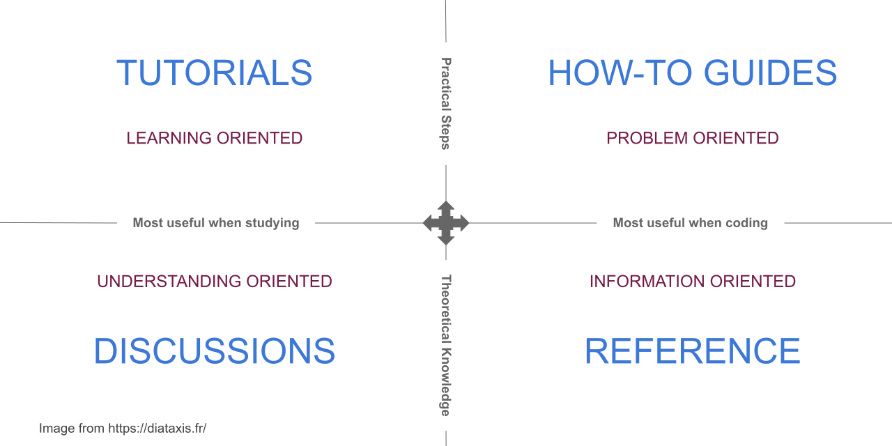

.. include:: ../../extras.rst.txt
.. highlight:: rst
.. index:: Diataxis; Introduction

.. _diataxis-intro:

=====================
Diátaxis Introduction
=====================

The Diátaxis Framework was developed by Daniele Procida.

Core values for using `Diátaxis  <https://diataxis.fr/>`__:

*  A systematic framework for authoring technical documentation.

*  Solves the challenge of structuring technical documentation.

*  A systematic approach to understanding documentation users needs.

The framework identifies four types of documentation:

#. Tutorials:Learning Oriented
#. How-to guides:Problem-Oriented
#. Reference: Information Oriented
#. Discussions: Understanding Oriented

Each documentation type requires a different approach to its creation.

Technical documentation should be structured explicitly around these four types and should keep them all separate and distinct from each other.

    Diataxis Framework

Tutorials
=========

A tutorial helps a beginner achieve basic competence.  It needs to show that the learner can succeed by having them do something both meaningful and attainable.

A tutorial is a lesson concerned with learning how rather than understanding why because it's practical, not theoretical.

The work required to create and maintain tutorials is far more than is needed for the other types of documentation.

For further interesting reading on this topic, see `Diátaxis Tutorials <https://diataxis.fr/tutorials/>`__

How-to guides
=============

How-to guides are goal-oriented directions, much like a recipe. They take the reader through the steps required to solve a real-world problem.

Examples could be calibrating a temperature sensor, using fixtures in pytest, and configuring a software package.

Building a web application is not addressing a specific goal or problem. It's a vastly open-ended sphere of skill that is not a how-to.

For further interesting reading on this topic, see `Diátaxis How-to <https://diataxis.fr/how-to-guides/>`__

References
==========

References are technical descriptions of the machinery and how to operate it. References are information-oriented.

References are like a map and should be to the point and authoritative.

References are consulted rather than read.

Like a map tells you what you need to know about a region without going out and checking yourself,
a reference serves the same purpose for the product and its internal machinery.

For further interesting reading on this topic, see `Diátaxis References <https://diataxis.fr/reference/>`__

Discussions
===========

Discussions clarify and illuminate a particular topic. Discussions are understanding-oriented.

Discussions deepen and broaden the reader's understanding of a subject.

Discussions aren't concerned with what the user might be doing, like tutorials and how-to guides.

Discussions approach a topic from a higher perspective and from different angles that allow a more relaxed, more unrestrained way to consider something.

Discussions join things together, and it makes sense to read while being away from the product itself.

For further interesting reading on this topic, see `Diátaxis Explanation <https://diataxis.fr/explanation/>`__
