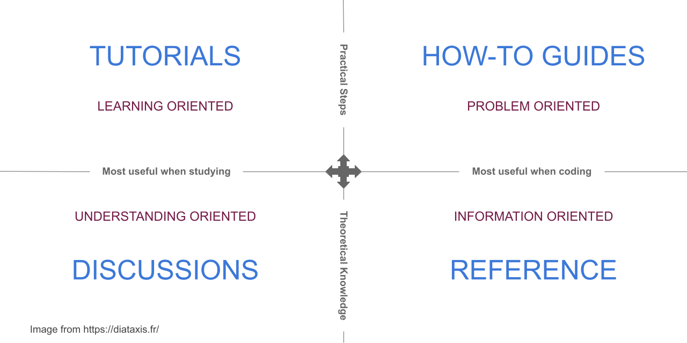

.. include:: ../../extras.rst.txt
.. highlight:: rst
.. index:: Diataxis; Introduction

.. _diataxis-quickstart:

===================
Diátaxis Quickstart
===================

A summary of each document type and purpose.

1. Tutorial:
------------

a. Allow the learner to understand what goals they will achieve before
   they start.
b. A tutorial helps a beginner achieve basic competence.
c. Allow the user to learn by doing.
d. Get the learner productive and succeeding from the very start.

2. How-to:
----------

a. How-to guides are goal-oriented directions, much like a recipe.
b. The goal of a how-to is to solve a problem or complete an unfamiliar task.
c. Explanations aren't necessary when following a how-to guide.
d. How-to guides should be flexible and adaptable to many use cases.

3. Reference:
-------------

a. References are technical descriptions of the machinery and how to
   operate it.
b. A reference guides focus is the product and must describe it as
   succinctly as possible.
c. Users consult reference material, so it should not contain any ambiguity.

4. Discussions:
---------------

a. Discussions clarify and illuminate a particular topic.
b. Discussions are understanding-oriented.
c. Discussions deepen and broaden the reader's understanding of a subject.
d. Connections, even to things outside the immediate topic, can add clarity
   and context.

Further Reading
===============

:ref:`Diátaxis Introduction<diataxis-intro>`

:ref:`Diátaxis Tutorials<diataxis-tutorials>`

:ref:`Diátaxis How-To<diataxis-how-to>`

:ref:`Diátaxis Reference<diataxis-reference>`

:ref:`Diátaxis Discussions<diataxis-discussions>`
