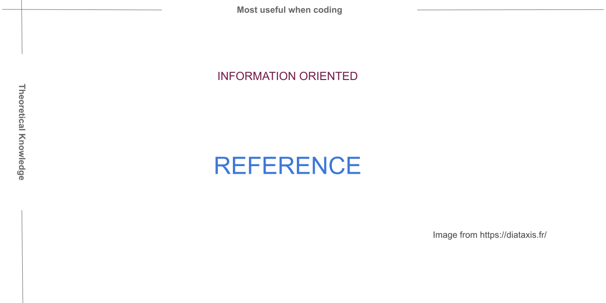

.. include:: ../../extras.rst.txt
.. highlight:: rst
.. index:: Diataxis; Reference

.. _diataxis-reference:

=========
Reference
=========

|

Summary
=======

References are technical descriptions of the machinery and how to operate it.
References are information-oriented.

References are like a map and should be to the point and authoritative.

References are consulted rather than read.

Like a map tells you what you need to know about a region without going out and
checking yourself, a reference serves the same purpose for the product and its
internal machinery.

About
=====

A reference guides focus is the product and must describe it as succinctly as possible.

Reference guides differ from tutorials and how-to's, where the user needs are the focus.

Software reference guides describe how to use the APIs, classes,  functions and so on.

Users see reference material as the source of truth.

An excellent technical reference provides users with confidence to perform their work
when using that product.

Description
===========

Users consult reference material, so it should not contain any ambiguity.

Reference material is akin to a map and shares the same purpose as a map for
the product it references.

Reference material should not show how to perform tasks but should describe how
something works or the correct way to use it.

Tools exist, such as  `Sphinx <https://www.sphinx-doc.org/en/master/>`__,  that
can auto document software API's using docstrings.  Sphinx is a convenient way to
keep API documentation relevant.

Its not a recipe
================

Reference guides, like an encyclopedia, will be consulted for information
on the given topic.

For example,  if you consider a recipe, there is a list of ingredients but
no explanation of what that ingredient is.

An encyclopedia shines here, providing up to date concise information about
the ingredient.

The focus of information delivery for a reference guide is much the same as
an encyclopedia.

How-to write a Reference
========================

**Mirror Structure**

A map conveys the structure of the area it maps. Likewise, a reference guide
should represent the structure of the product it references.

For example, a software reference guide should follow the software's architecture.

What we mean by following the software architecture is that the conceptual and
logical arrangement of the reference guides parts should mirror that of the
software where possible.

**Consistency**

Write consistency into references from six essential areas:

#. Concise factual information.
#. Consistent logo or branding placement.
#. Consistent colours.
#. Consistent tone in writing.
#. Consistent imagery.
#. Consistent Typography, layout and formatting.

Writing tone is possibly the most important, with intelligent use of language that
is purposeful and doesn't use uncommon or obscure words where possible.

**Just Describe**

A reference is a concise, factual document, so there is no room for speculation,
opinions, or discussion.

Reference guides may sometimes seem bare; however, providing links to
tutorials and how-to's where appropriate is better than confusing the
focus of the reference.

**Examples**

Good examples can help the reader connect ideas, concepts and how the machinery
interacts with each other, especially if they involve levels of abstraction.

Further Reading
===============

For further interesting reading on this topic, see `Diátaxis References <https://diataxis.fr/reference/>`__
