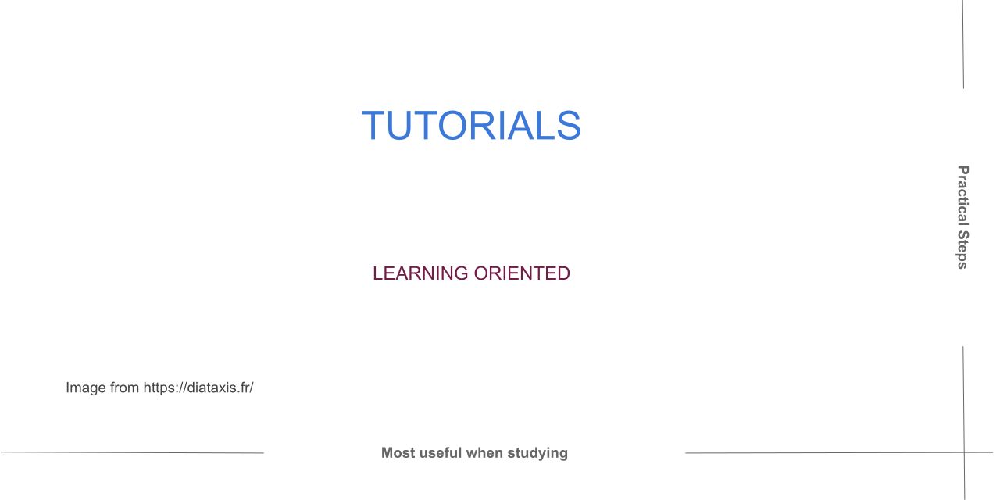

.. include:: ../../extras.rst.txt
.. highlight:: rst
.. index:: Diataxis; Tutorials

.. _diataxis-tutorials:

=========
Tutorials
=========

Summary
=======

A tutorial helps a beginner achieve basic competence.  It needs to show that the learner can succeed by having them do something both meaningful and attainable.

A tutorial is a lesson concerned with learning how rather than understanding why because it's practical, not theoretical.

The work required to create and maintain tutorials is far more than is needed for the other types of documentation.

Dont be a teacher
=================

Allow the user to learn by doing; it's how we know to walk and talk.

Give your learners things to do through which they can succeed and then
begin to understand the subject.

As you lead the pupil through the steps of your tutorial, allow them to
use the tools and perform the operations required to become familiar with
the subject.

Build their knowledge up from the simplest tasks and ideas at the start to
more complex ones as they progress.

Get Started
===========

Get the learner productive and succeeding from the very start.

Becoming an expert is not achievable here, and attempting this may
lead our new contributors to self-doubt and drop out.

Please start at the very beginning: a user can pick up on the tutorial from new
information, to them, begins.

If they need something and it's not covered, the tutorial will seem incomplete to
them, and you risk losing them.

It is ok if the tutorial would not be considered best practice by an experienced
practitioner.

A beginners tutorial is a set of tasks that helps them set out safely on a journey
of discovery, and it's about the journey, not the destination.

Share the full view
===================

Allow the learner to understand what goals they will achieve before they start.

Setting the expectations at the start of the tutorial allows them to build a
mental map of the journey towards the completed goal.

Surprises along the way may diminish the experience and can confuse.

Using What, How, Why and When logic, an example of setting the expected
outcome could be:

   :emph:`What`

   You will build a simple Django website and deploy it using Docker on
   your local machine.

It must work
============

Ensure the beginner's confidence by maintaining a friendly tone with consistent
use of language.

The best way to maintain confidence is by providing a tutorial that works consistently.

Pinning all the requirements and using virtual environments can help in this endeavour
for software development tutorials.

Documenting package requirements in the tutorial may be helpful for the long term
maintenance of the tutorial, and preparing the beginner for further learning.

It's challenging creating and maintaining a reliable tutorial experience.

Please aspire to create a reliable and interesting tutorial to guarantee your
beginners success and enjoyment.

Instant Results
===============

Your learner is here to experience new and unfamiliar things.

Completing too many tasks before seeing a result from their actions may lead to a
poor experience and retention rate.

Show the relationship between the cause and effect of each step very soon after,
if possible.

Each step should be meaningful to the user.

Same Results
============

The users of your tutorial will have different backgrounds and probably using
various operating systems.

Repeatability and reliability can be challenging to achieve with these constraints.

Yet, your tutorial should work for all users, every time.

Testing your tutorials across the many possible environments ensures they will
work as expected.

Concrete is your friend
=======================

Tutorials should be composed of concrete steps, not abstract discussions.

    Explicit is better than implicit regarding tutorial actions and outcomes.

Learning starts by meandering along concrete paths towards more general and
abstract concepts.

After a beginner has walked many concrete paths, they are ready to see the
patterns in them.

Expecting a learner to absorb abstract concepts in a beginner tutorial can
be confusing and places an unnecessary burden on them.

Minimalism is the key
=====================

Don't provide explanations in the tutorial unless it is critical to the
understanding of that step.

It's enough to say - We are using HTTPS because it's very secure. Discussion
of HTTPS is essential in the proper learning phase but not in a tutorial.

When asking a user to do things without much explanation can appear problematic.

For the learner, it rarely is. The learner will focus on following directions
and getting a result.

Cautious use of links to additional explanatory material may help.

Don't interrupt the flow of a tutorial; adding links to a "Further Reading"
section at the end of the tutorial keeps the clutter out.

Stay focussed
=============

Walking a concrete tutorial path may present exciting diversions along the way.

Remain focused on what's required to reach the tutorial goals, and everything else can wait for another time.

Doing this keeps the tutorial more concise, saving you and the reader from the extra cognitive load.

Further Reading
===============

For further interesting reading on this topic, see `Diátaxis Tutorials <https://diataxis.fr/tutorials/>`__.
