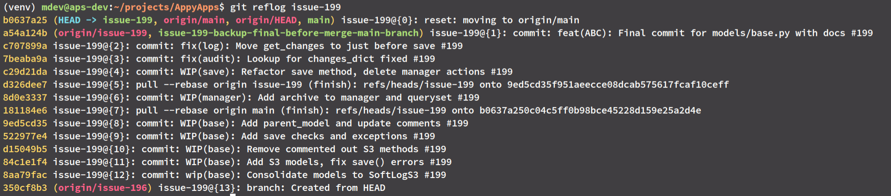
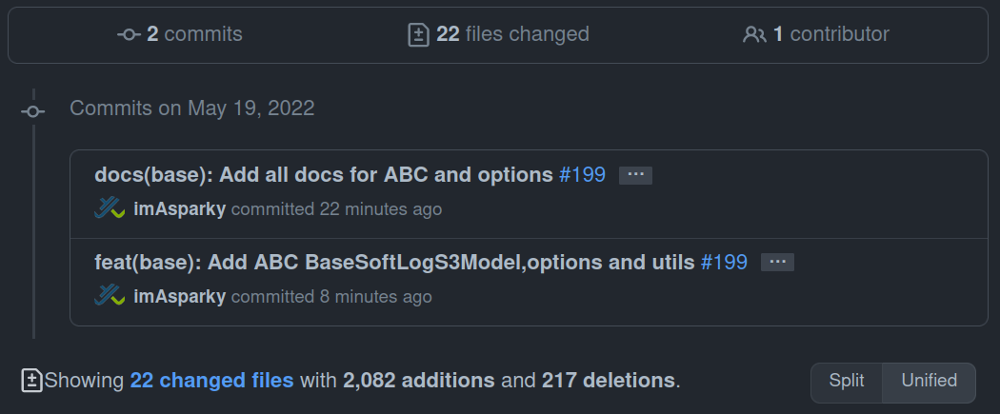
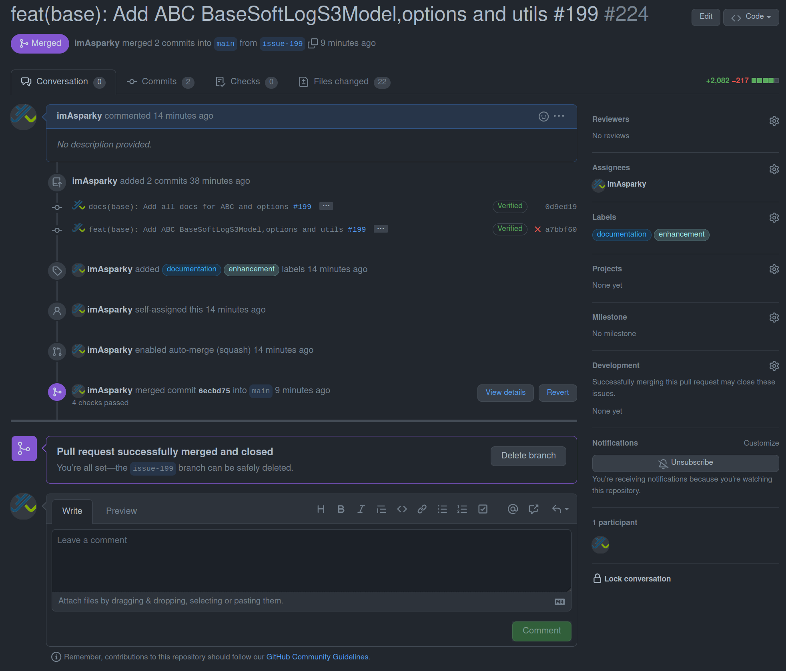
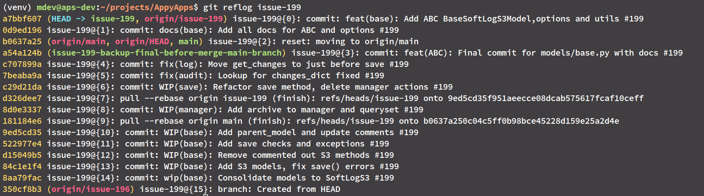

.. include:: ../../extras.rst.txt
.. highlight:: rst
.. index:: how-to-git-clean-commits-workflow ; Index

.. _how-to-git-commits-clean-workflow:

==========================
Git Commits Clean Workflow
==========================

This workflow is an abridged version of `Git Organized A Better Git Flow`_.

A prominent feature branch can have many commits that include unrelated work,
such as a minor bug fix.

These commits can make future work, for example, `git revert` complex and
time-consuming and, in some cases, re-introduce new bugs.

The Git Commits Clean Workflow workflow will remove those problems by allowing
commits as you work and then a final cleanup and grouping at the end.

Follow these steps when you are ready to pull your feature into the main branch.

.. _Git Organized A Better Git Flow: https://render.com/blog/git-organized-a-better-git-flow

.. _how-to-git-reset-main:

1. Reset Branch to Main
=======================

|

This command resets to an older commit on the `main branch`; git status will
show all the changes you've made since you started building your feature as
if you have not made any commits.

.. code-block:: bash
    :caption: Command to run when working in the feature branch.

    git reset origin/main

|

.. code-block:: bash
    :caption: `git status` terminal output shows all changes are now unstaged.

        mdev@aps-dev:~/projects/{{cookiecutter.git_project_name}}$ git status
        On branch issue-199
        Your branch and 'origin/issue-199' have diverged,
        and have 12 and 22 different commits each, respectively.
        (use "git pull" to merge the remote branch into yours)

        Changes not staged for commit:
        (use "git add/rm <file>..." to update what will be committed)
        (use "git restore <file>..." to discard changes in working directory)
                modified:   .env/.local
                modified:   .gitignore
                modified:   core/utils/convertors.py
                modified:   docs/source/discussion/index-discussion.rst
                deleted:    docs/source/how-to-guides/how-to-audit-logs.rst
                modified:   docs/source/how-to-guides/how-to-git-cheatsheet.rst
                deleted:    docs/source/how-to-guides/how-to-models-with-S3-needs.rst
                modified:   docs/source/how-to-guides/how-to-soft-delete-models.rst
                modified:   docs/source/how-to-guides/index-how-to.rst
                modified:   docs/source/reference/ref-ABC-soft-delete.rst
                modified:   docs/source/tutorials/index-tutorials.rst

        Untracked files:
        (use "git add <file>..." to include in what will be committed)
                core/exceptions.py
                core/models/base.py
                core/models/managers.py
                core/tests.py
                core/utils/handlers.py
                docs/source/_static/imgs/how-to-guides/git-reflog-branch-199.png
                docs/source/_static/imgs/reference/
                docs/source/discussion/discu-models-with-S3-needs.rst
                docs/source/how-to-guides/how-to-git-clean-commits-workflow.rst
                docs/source/how-to-guides/how-to-soft-delete-with-S3-file.rst
                docs/source/how-to-guides/how-to-soft-delete-with-S3-images.rst
                docs/source/how-to-guides/how-to-soft-delete-with-audit.rst
                docs/source/tutorials/tutorial-use-BaseSoftLogS3Model.rst

|

Image showing a long list of commits for a feature branch.

|

.. _how-to-git-logical-commits:

Create Logically Grouped Commits
================================

|

Review the terminal output above, and we can see there are logical groupings,
for example, docs and core.

We can add all the docs to one commit with a targeted commit message that makes
sense for all the changes.

.. code-block:: bash

   git add docs/source/*

|

.. code-block:: bash
    :caption: All docs staged ready for logical grouping commit.

        On branch issue-199
    Your branch and 'origin/issue-199' have diverged,
    and have 12 and 22 different commits each, respectively.
      (use "git pull" to merge the remote branch into yours)

    Changes to be committed:
      (use "git restore --staged <file>..." to unstage)
            new file:   docs/source/_static/imgs/how-to-guides/git-reflog-branch-199.png
            new file:   docs/source/_static/imgs/reference/BaseSoftLogS3Model.png
            new file:   docs/source/_static/imgs/reference/mindmup_save.png
            new file:   docs/source/_static/imgs/trading/mm_images/trading_volatile_markets.png
            renamed:    docs/source/how-to-guides/how-to-models-with-S3-needs.rst -> docs/source/discussion/discu-models-with-S3-needs.rst
            modified:   docs/source/discussion/index-discussion.rst
            deleted:    docs/source/how-to-guides/how-to-audit-logs.rst
            modified:   docs/source/how-to-guides/how-to-git-cheatsheet.rst
            new file:   docs/source/how-to-guides/how-to-git-clean-commits-workflow.rst
            modified:   docs/source/how-to-guides/how-to-soft-delete-models.rst
            new file:   docs/source/how-to-guides/how-to-soft-delete-with-S3-file.rst
            new file:   docs/source/how-to-guides/how-to-soft-delete-with-S3-images.rst
            new file:   docs/source/how-to-guides/how-to-soft-delete-with-audit.rst
            modified:   docs/source/how-to-guides/index-how-to.rst
            modified:   docs/source/reference/ref-ABC-soft-delete.rst
            modified:   docs/source/tutorials/index-tutorials.rst
            new file:   docs/source/tutorials/tutorial-use-BaseSoftLogS3Model.rst

    Changes not staged for commit:
      (use "git add <file>..." to update what will be committed)
      (use "git restore <file>..." to discard changes in working directory)
            modified:   .env/.local
            modified:   .gitignore
            modified:   core/utils/convertors.py

    Untracked files:
      (use "git add <file>..." to include in what will be committed)
            core/exceptions.py
            core/models/base.py
            core/models/managers.py
            core/tests.py
            core/utils/handlers.py

.. code-block:: bash
    :caption: Commit logically grouped staged files with a meaningful commit message.

    git commit -S

|

.. rubric:: Continue to logically add and commit your files using this process
  until you have the feature ready to push to the repo and merge into the main branch with a pull request.

|

Git Pull Request
================

See the image below for the cleaned up commit history ready for merging into main.

|

and the successfully merged feature branch.

|

and the `git reflog` after clean commits. Notice the top two lines.

|

Troubleshooting
===============

Push to Remote Branch
---------------------

It is possible to encounter an error when pushing your cleaned up commits
history to the remote branch.

.. code-block:: bash
    :caption: git push to remote `! [rejected]`

    (venv) mdev@aps-dev:~/projects/{{cookiecutter.git_project_name}}$ git push origin issue-199
    To github.com:imAsparky/{{cookiecutter.git_project_name}}.git
     ! [rejected]          issue-199 -> issue-199 (non-fast-forward)
    error: failed to push some refs to 'github.com:imAsparky/{{cookiecutter.git_project_name}}.git'
    hint: Updates were rejected because the tip of your current branch is behind
    hint: its remote counterpart. Integrate the remote changes (e.g.
    hint: 'git pull ...') before pushing again.
    hint: See the 'Note about fast-forwards' in 'git push --help' for details.

|

Many things can cause this.  Solve this problem by using a force push to the
remote repository.

.. code-block:: bash
    :caption: Force push to remote

     git push -f origin <branch name>

