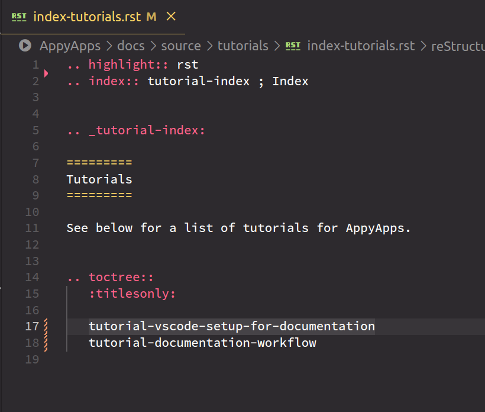

.. include:: ../extras.rst.txt
.. highlight:: rst
.. index:: documentation-workflow-tutorial ; Index

.. _documentation-workflow-tutorial:

======================
Documentation Workflow
======================

|

This tutorial explains the project documentation workflow.

|

Pre-requisites
==============

For this tutorial to work please ensure you have configured vsCode as per
:ref:`VS Code Set-up <vscode-publish-documentation-tutorial>`.

|

.. _workflow-overview:

Overview
========

The document folder structure follows the standard Sphinx [#]_ format for
different build and source folders.

This tutorial does not cover how to use Restructured Text `reST` [#]_ to
create documents.

Documentation follows the Diátaxis [#]_ framework, seen in the image below,
with document folders for tutorials, how-to's, reference and discussion documents.

Some templates exist as a guide to the layout of each Diátaxis document
type, and are available in `doc-templates`.

.. note::

    `index-templates` is the index for document templates, and `template-index`
    is the actual template.

|

|

.. _vscode-setup-workflow-tutorial:

Preview Document
================

A convenient preview is available to check how your document looks after
rendering it to HTML.  The rendering engine uses the `esbonio` language server.

|

The following image shows the docs folder structure on the left and the edited
document in the centre.

|

After saving the document, using the centre button below will display the
HTML rendered view.

|

|

See the rendered HTML below in the right panel.

|

|

.. tip::

    Dont forget to add your new documents to the relevant index.
    See this update in the index image below.

    Add the document to the index using the doc name without the `rst` extension.

|

|

.. _vscode-publish-documentation-tutorial:

Publishing Documentation
========================

Documents are built locally and pushed to, then served by Digital Ocean S3.

Follow these steps once you have completed writing documentation and are ready
to publish.

From the CLI in the `docs` folder, type this command.  The `docs` folder
contains `make.bat` and `Makefile`.

.. code-block:: bash

    sphinx-build -b html source html

Change the working directory to the root folder containing `manage.py`, and in
the CLI, type the following command.

.. code-block:: bash

    ./manage.py collectstatic

Answering `yes` will push the documentation HTML to the Digital Ocean S3
static folder, where it will be available in the `Admin` dropdown menu.

Below is a suitable bash alias to complete the two commands above.

.. code-block:: bash

    alias sb="sphinx-build -b html docs/source docs/html && ./manage.py collectstatic"

|

.. _vscode-version-documentation-tutorial:

Version Control
===============

Once completed, follow the typical Git workflow to push all updated
documentation to a feature branch, then make a pull request to the `main` branch.

|

.. rubric:: Footnotes

.. [#] https://www.sphinx-doc.org/en/master/
.. [#] https://junction-box.readthedocs.io/en/latest/how-to/reST/how-to-reST-intro-rest-sphinx.html
.. [#] https://junction-box.readthedocs.io/en/latest/Document-Framework/diataxis-quickstart.html
