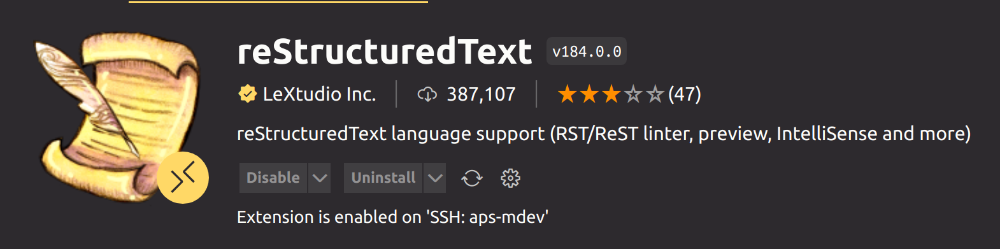
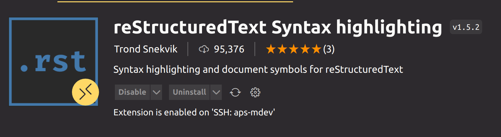

.. include:: ../extras.rst.txt
.. highlight:: rst
.. index:: vscode-setup-docs-tutorial ; Index

.. _vscode-setup-docs-tutorial:

=============================
VS Code Setup - Documentation
=============================

|

{{ cookiecutter.project_name }} use restructured text (reST) and the `Sphinx` [#]_ documentation
build engine.

This tutorial explains the steps to set up and use the documentation workflow.

Writing documentation using reST is not covered here.

See `Restructured text` [#]_, and the `Diataxis` [#]_ document framework
for assistance producing documentation.

.. important::

    All documentation changes shall be attached to either a work or
    documentation issue, and updated into the main branch.

    Pushing documentation to S3 does not save the raw documentation files.

|

Pre-requisites
==============

A `django-cookiecutter` project and VS Code.

|

.. _vscode-setup-deps-tutorial:

Dependencies
============

All these dependencies are included in a standard `django-cookiecutter` project.

.. code-block:: bash

    esbonio  # dep in config/requirements/local.txt
    furo     # remainding deps in docs/requirements.txt
    myst-parser
    Sphinx
    sphinx-copybutton
    sphinx_inline_tabs

|

You can check whether these dependencies exist in the Virtual Environment.
In the Command Line type in the folder containing the venv:
And check the output includes the dependencies above.

.. code-block:: bash

    . venv/bin/activate

    pip freeze

|

.. _vscode-setup-tutorial:

VS Code Setup
=============

This setup will work for any standard Dunwright project.

VS Code has excellent extensions with easy configuration to produce, lint and
preview restructured text files.

Extensions
----------

Install these two extensions for linting and live preview.

|

LeXtudio uses this extension for restructured text highlighting.

|

.. _vscode-setup-workspace-tutorial:

VS Code Workspace File
======================

Esbonio language server is a new server and is under constant development.

The current version and immediately following will only support single root
workspaces.  See the example below, "folders" only contain the project's
root path.  Any additional folders here will cause the esbonio language
server to fail.

You can copy this workspace folder example into your root if you don't have
an existing one or add the esbonio settings to yours.

If you copy this config file,  place it in the root folder with the name
of `{{cookiecutter.git_project_name}}.code-workspace` and without any extensions.

.. code-block:: json

    {
        "folders": [
            {
                "path": "."
            }
        ],
        "settings": {
            "esbonio.server.enabled": true,
            "esbonio.sphinx.buildDir": "${workspaceFolder}/docs/source/_build/html",
            "esbonio.sphinx.confDir": "${workspaceFolder}/docs/source",
            "esbonio.sphinx.srcDir": "${workspaceFolder}/docs/source",
            "esbonio.server.logLevel": "debug",
            "python.testing.unittestEnabled": false,
            "python.testing.pytestEnabled": true,
            "liveServer.settings.multiRootWorkspaceName": "{{cookiecutter.git_project_name}}",
            "[python]": {
                "editor.defaultFormatter": "ms-python.black-formatter"
            },
        }
    }

|

Using the workspace
-------------------

In VS Code <File><Open Workspace from File> to activate the workspace.
All these settings will be activated when the workspace opens.

|

.. rubric:: Footnotes

.. [#] https://www.sphinx-doc.org/en/master/
.. [#] https://junction-box.readthedocs.io/en/latest/how-to/reST/how-to-reST-intro-rest-sphinx.html
.. [#] https://junction-box.readthedocs.io/en/latest/Document-Framework/diataxis-quickstart.html
